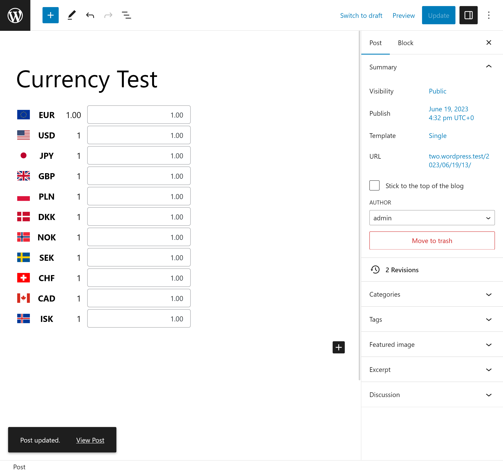
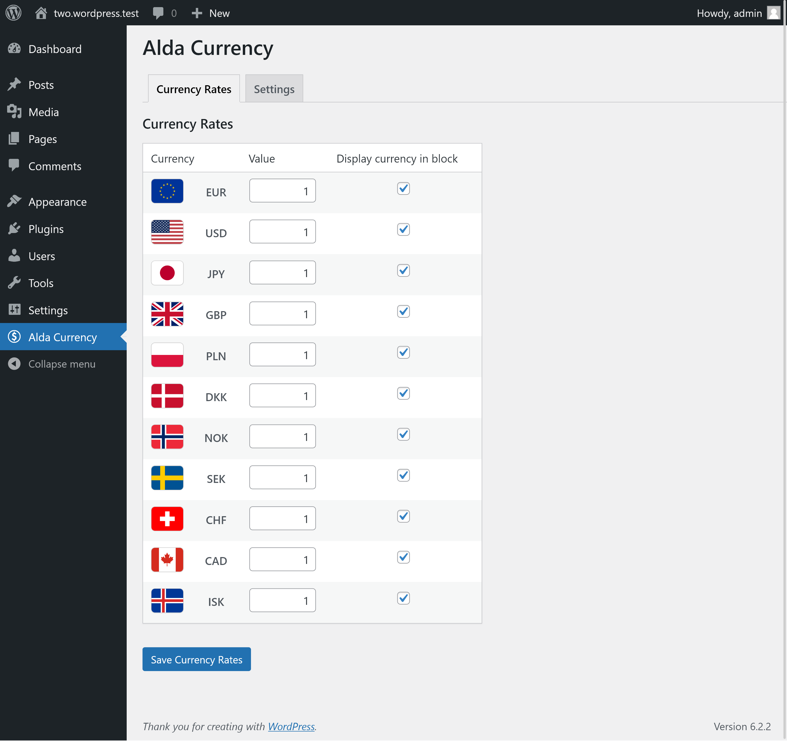

# Alda Currency

This plugin provides a simple interactive currency conversion block that can be
inserted into your posts, pages and your WordPress FSE layout.

## Screenshots





## Develop and Build

This project uses a couple of npm packages and scripts to get things going:

```bash
npm install
npm wp-scripts build
npm run build-admin-css
npm run build-admin-js
npm run build-frontend-component
npm run build-frontend-module
```

## Release

Given than you haven't added new files that need to be included in a zip archive
for release, you can run the automatic process for that:

```bash
npm npm run plugin-zip
```

This creates `alda-currency.zip` in the root directory of the project that can
be used.

## TODOs

* Sanitize values before they are entered using a POST request to the JSON API.
* Add and improve error handling
* Introduce translations/localizations.

## Licence

This software is realeased under the GPL-3.0 licence.
